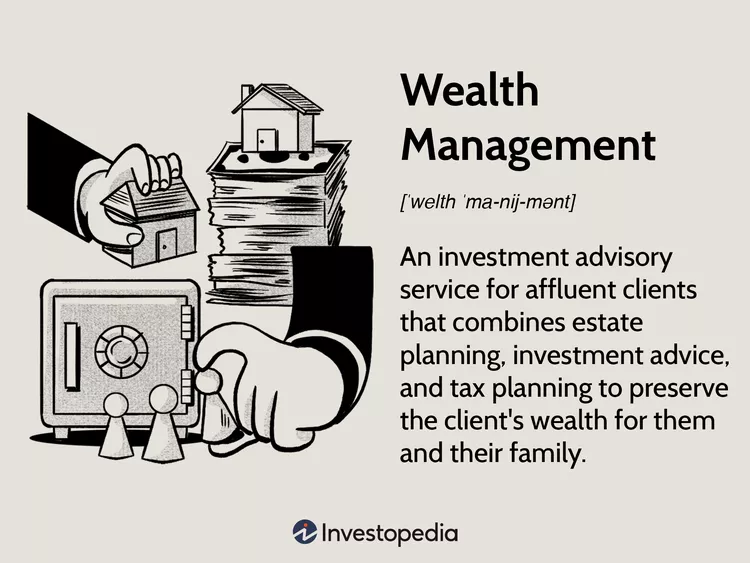

# **CASE STUDY:** Wealth Management

## ***What is Weath Management?***

---

Wealth Management is investment advice that combines financial services to address the needs of clients.

According to Investopedia.com; "Wealth management is more than just investment advice. It can encompass all parts of a person’s financial life. Instead of attempting to integrate pieces of advice and various products from multiple professionals, high net worth individuals may be more likely to benefit from an integrated approach. In this method, a wealth manager coordinates the services needed to manage their clients’ assets, along with creating a strategic plan for their current and future needs—whether it is will and trust services or business succession plans." 1

Wealth Mangement was once considered a service for the rich and wealthy, but over the past several years it is something that even personal banks offer to their clients regardless of your net worth. People can also lean how to manage their wealth themselves. 2

Some of the largest Wealth Management companies in Canada are TD Asset Management, 1832 Asset Mangement (Scotia), RBC Asset Management, Fidelity Investments, Blackrock, CI Financial to name a few. 

There are independent companies such as Cacheflo, D1g1t who educate professionals as well as individuals to become Cashflow Specialists in managing their own money as well as being qualified to manage money for others. 

## Conclusion

Being able to manage your weath no matter how wealthy you are is a service that should be available to everyone. By educating people on how to manage their wealth it gives opprotunity to all to be able to control their finances and live within their means. Do you need to hire a wealth manager or should you learn to mange your own wealth? As an individual find what fits best for you. 

---

**References:**

1. [Investopedia - Wealth Management](https://www.investopedia.com/terms/w/wealthmanagement.asp)

2. [Brain World Magazine - "Wealth Management is not just for the wealthy."](https://brainworldmagazine.com/why-wealth-management-isnt-just-for-the-wealthy/)

3. [Forbes - "What is wealth mangement?"](https://www.forbes.com/advisor/investing/financial-advisor/what-is-wealth-management/)

